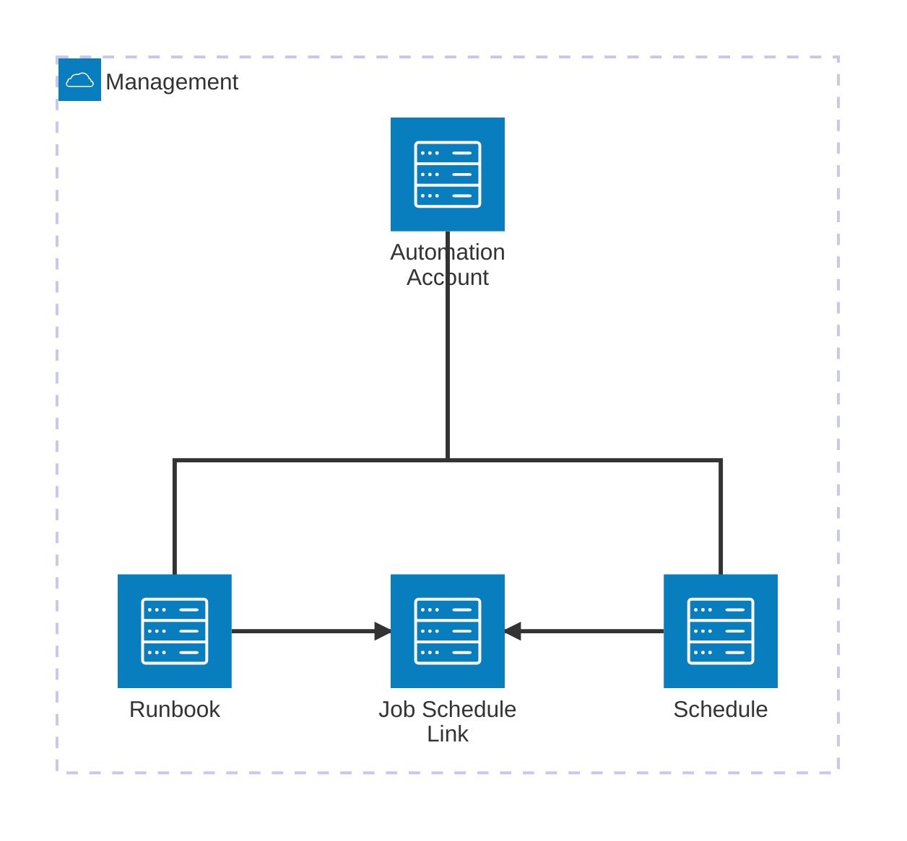

# Introduction

The azureDeploy.json in this folder deomstrates that is is now possible to deploy an Automation Account, Runbook, Schedule and Jobschedule in a repeatable manner.

# Introduction
The azureDeploy.bicep in this folder deomstrates that is is now possible to deploy an Automation Account, Runbook, Schedule and Jobschedule in a repeatable manner.

#### Automation Account, Runbook and Schedule

##### Notes
- The Schedule Link name has to be a GUID (UUID), and cannot be reused if its removed
- Due to way ARM handles deletions (post deployment), the link cannot be removed and created in the same operation.
