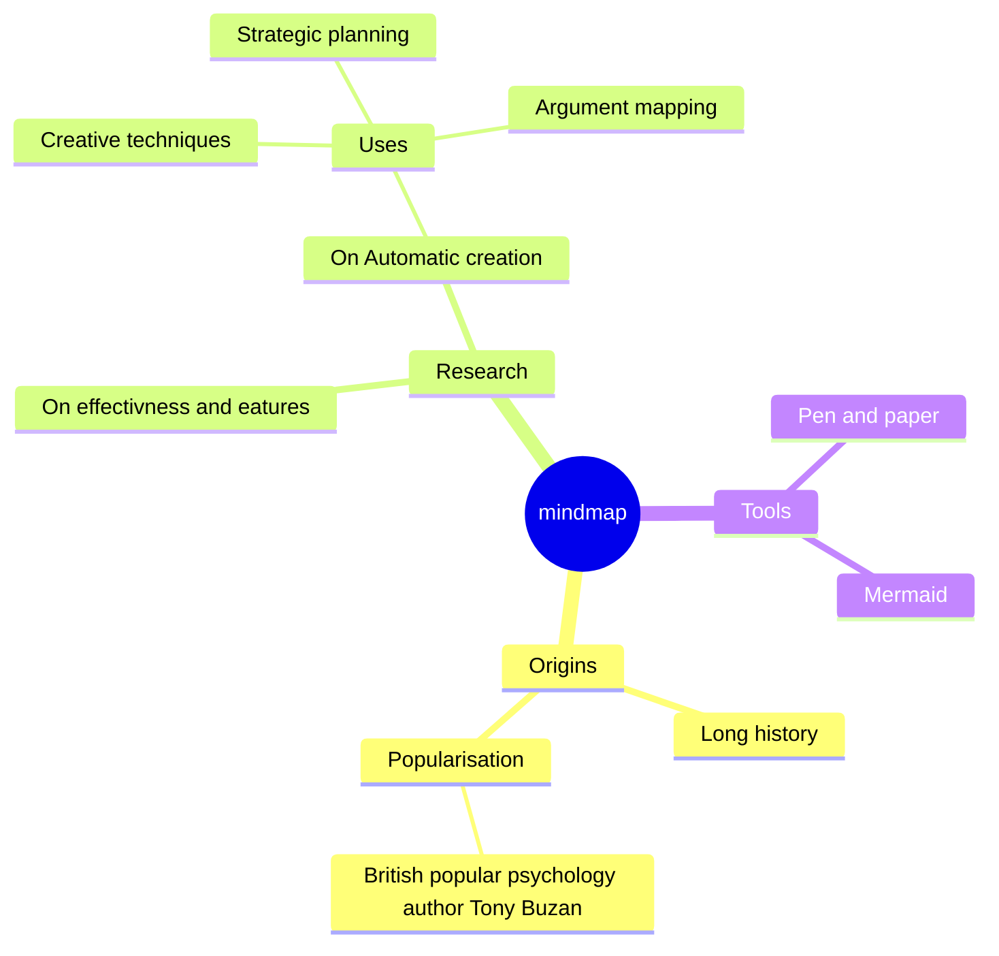

# Introduction

This repository holds the Azure Image Builder ARM templates and necessary scripts required to an Azure DevOps Build Agent.

In some situations the Azure DevOps hosted build agent is not sufficient, either the toolset is incompatable or there are extra requirements such as running under a defined identity or within a security boundry.

## Getting Started

See the information at [Azure Image Builder Service](https://docs.microsoft.com/en-us/azure/virtual-machines/image-builder-overview) as an introduction.

## Build and Test

