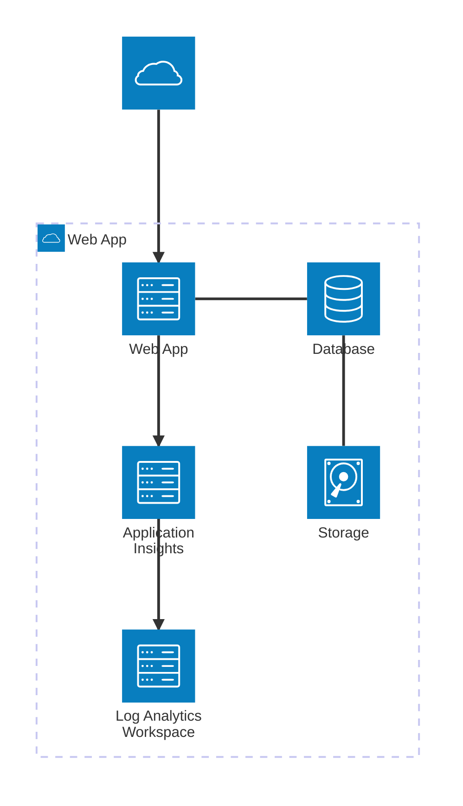
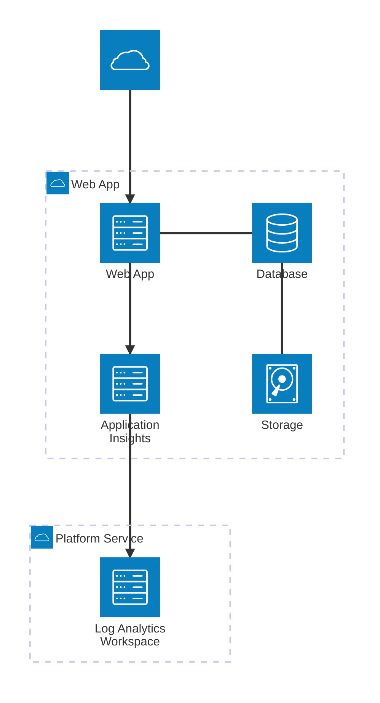

# Introduction

This Bicep template deploys a an Azure application app service and associated application insights instance.

## Notes

These Bicep templates are meant as a starter resource, to be modified to your own requirements.
