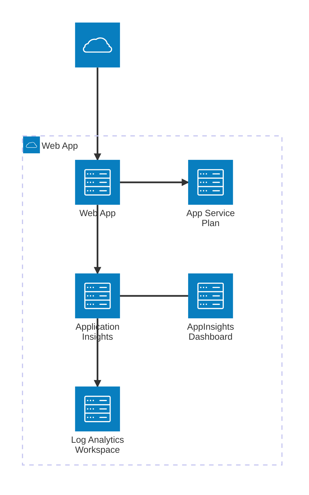
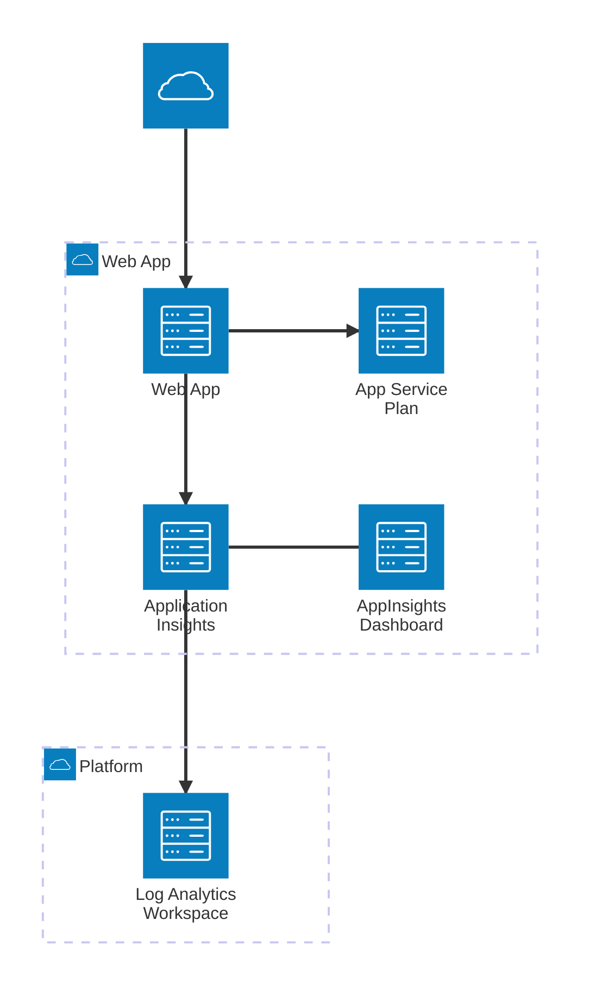

# Introduction

This Bicep template deploys a Azure application app service and associated application insights instance.

## Parameters
```
	@description('The location of the resources created, excluding 'Global', defaults to the resource group location.')
	param location string = resourceGroup().location

	@description('The environment tag to provide unique resources between test / production and ephemeral environments.')
	param environment string = 'ObjInt'

	@description('The external Log Analytics Workspace to connect to, if blank a local workspace will be created, defaults to blank.')
	param logAnalyticsWorkspaceResourceId string = ''
```

#### With Dedicated Log Analytics Workspace


#### With Shared Log Analytics Workspace

## Notes
These Bicep templates are meant as a starter resource, to be modified to your own requirements.
