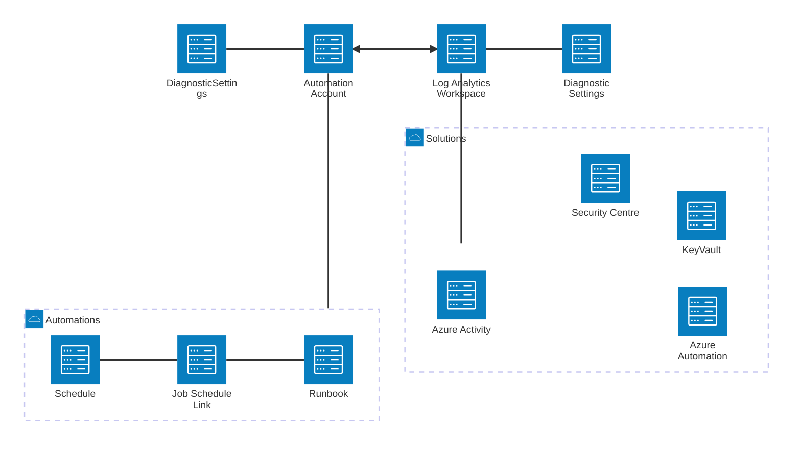

# Read Me

## Introduction

Taken from the Microsoft Enterprise Scale Cloud Adoption Framework these templates attempt to provide co-operating ARM tempaltes to deploy the first the basic subscriptions, this is

- Management

The management subscription contains the core log analytics workspace, a linked automation account and common dashboards.

#### Platform Log Analytics

