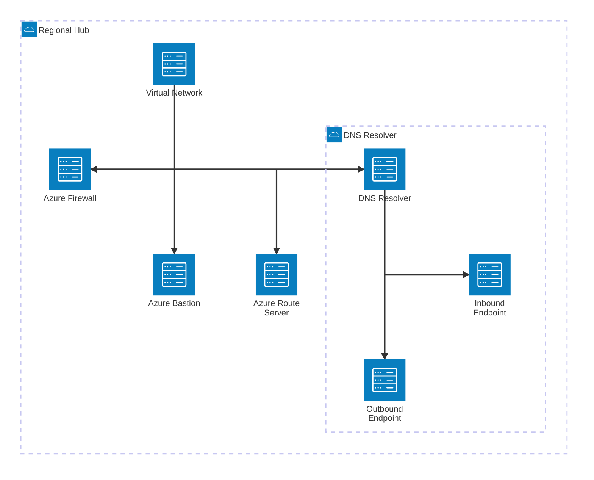

# Introduction
Depending on your requirements there are two way to achieve a hub and spoke network design within Azure, either using the newer vWAN capability or a more traditional hub and spoke impelementation.  Your choice will depend a lot on the rexperience within your company and the caoabilities you desire.

Some reasons for selecting the more traditional approach include
- private DNS integration (still possible with vWAN with alternative design)
- Azure Bastion
- Express Route Global Reach
- Route Server

## Services on Offer
Some of the services offered in a hub may include
- STS VPN
- PTS VPN
- Azure Firewall
- Express Route
- Azure Bastion
- Custom DNS Implementation

#### VNet Connected Services

